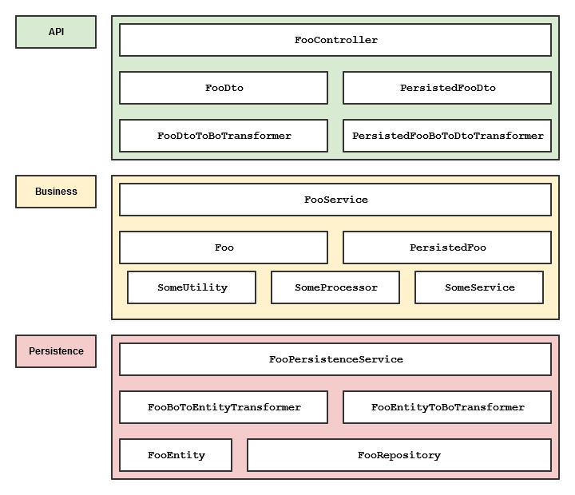

# Test Automation of Spring Boot Applications

In this article I will demonstrate how test automation for Spring Boot
applications is done. For this purpose let's imagine the following example
application:



The application consists of 4 major packages: `api`, `business`, `persistence`
and `ui`. They represent the different logical layers of the application. Within
these layers there are packages for generall concerns (e.g. common businness
exceptions) and packages for special domain concerns (e.g.
`com.example.sbms.business.foo` containing all `Foo` related components and
services). Grouping classes in packages firstly by their layer and secondly by
their functional affiliation allows us to selectively start parts of our
application. This is very usefull for integration-scoped or even system-scoped
tests. You could, as an example, start you application's API layer without
having to have a database - or even a business layer - simply by telling Spring
to only scane the `com.example.sbms.api` package for beans. Missing dependencies
can easily be mocked using Spring's own testing framework.

The source folder of this application would look something like this:

```
[com.example.sbms]
  Application.java
  [api]
    [v1]
      ErrorDto.java
      [foo]
        FooDto.java
        PersistedFooDto.java
        FooController.java
        FooDtoToBoTransformer.java
        PersistedFooBoToDtoTransformer.java
      [bar]
        ...
  [business]
    Settings.java
    [exceptions]
      AlreadyExistsException.java
      NotFoundException.java
    [objects]
      Foo.java
      PersistedFoo.java
      Bar.java
    [foo]
      FooService.java
      SomeUtility.java
      SomeProcessor.java
      someService.java
    [bar]
      ...
  [persistence]
    [foo]
      FooEntity.java
      FooBoToEntityTransformer.java
      FooEntityToBoTransformer.java
      FooRepository.java
      FooPersistenceService.java
    [bar]
      ...
  [ui]
    [foo]
      FooUiController.java
      ...
```

You should have at least a rudimentary understanding of the following topics
before reading any further:

- Spring
- Spring Boot
- Testautomation (ideally with JUnit)
- Assertions (ideally with AssertJ)
- Mocking (ideally with Mockito)

## Automated Tests

When writing automated tests, it is important to know what should be tested how
and what the scope of the test should be. When working with Spring Boot I
usually devide my tests into three scopes:

- Unit
- Integration
- System

Each of these has it's own uses and constraints and each builds the basis for
the next scope. Wehn executing a build, the unit-scoped tests should run first.
They are the most numerous and the fastes. If any of them break, the build
should imidiatly fail without executing any other tests of higher scopes. If all
unit-scoped tests passs, the integration-scoped tests are executed. These will
verify our usage of framework features and the integration of different parts of
the application. Last but not least the system-scoped tests wil be executed.
These are the only tests which are allowd to block system resources (like
sockets, ports, databases etc.).

Mor on each of those, when we come to them in the following chapters.

The code example in this articale will make use of these technologies:
- JUnit 5 as a runner for most tests
- JUnit 4 as a runner for tests which need the Spring JUnit Runner
- AssertJ for assertions
- Mockito for mocking (often with BDD style given / then syntax)
- Project Lombok for code generation (Getter, Setter, Constructors, etc.)
- Spring MockMvc for REST controller integration tests

### Unit Scope

Unit-scoped tests are the most common test you'll write for your Spring Boot
application. In most projects each class will have a corresponding unit test
class verifying that whatever the class is doing, is done as intended. As with
everything there might be exceptions to the rule!

Most unit-scoped tests will invoke a single method with a given set of input
data and a previously established state of the unit under test. Each of these
tests should focus on a single aspect of the invoktion to be tested. Don't mix
multiple aspects together or you'll get unit test that fail for hard to identify
reasons.

We'll not go into any more datail on the genrall topic of unit tests since these
are well established principles and nothing special to Spring Boot applications.

#### Testing API DTO Serialization

Since the data transfer objects (DTO) used in our API will be serialized and
de-serialized as/from JSON or XML, we need to assert that this can be done
without any problems. There are a supprising amount of things which can go wrong
when serializing Java objects.

Testing (de-)serialization is rather simple and inexpensive. Simple serialize a
given object into JSON / XML and then use that result to de-seriaialize it back
to it's original form. With AssertJ the asserion of the result of these
operations is pretty simple. Just check for equality of the original object and
the de-serialized version.

A simple equality check should be enough, because DTOs are data objects and
should therefore always implement `equals()` and `hashcode()`. With Lombok's
`@Data` annotation, which among other things, generates an `equals()` and
`hashCode()` implementation for all fields this is done with a single line of
code. In addition DTOs should only consist of Java basic types (`String`,
`boolean`, `int` etc.) and other DTOs.

Now lets take a look at this simple DTO:

```java
@Data
@Builder
@NoArgsConstructor(access = AccessLevel.PUBLIC)
@AllArgsConstructor(access = AccessLevel.PRIVATE)
public class PersistedFooDto {
  @NotNull
  private Long id;
  @NotEmpty
  private Set<String> values = new HashSet<>();
}
```

The generated builder makes it easy for us to create data for our serialization
test.

```java
public class PersistedFooDtoTest implements DtoStereotypeTest {

  @Test
  @DisplayName("can be (de)serialized from and to JSON")
  void jsonSerializable() throws IOException {
    PersistedFooDto dto = PersistedFooDto.builder()
      .id(42L)
      .values(Sets.newHashSet("abc", "def"))
      .build();
    assertJsonSerializable(dto);
  }

}
```

Since we rarely create applications with just a single DTO, we should put the
actual assertion logic into a separate class. Making it reusable by other
tests. With Java 8, we can even create a trait interface which allows our test
to inherit multiple such traits from different interfaces.

```java
public interface DtoStereotypeTest {

  default void assertJsonSerializable(Object object) throws IOException {
    ObjectMapper mapper = new ObjectMapper()
    String jsonObject = mapper.writeValueAsString(object);
    Object deserializedObject = mapper.readValue(jsonObject, object.getClass());
    assertThat(deserializedObject).isEqual(object);
  }

  default void assertXmlSerializable(Object object) throws IOException {
    // ...
  }

}
```

#### Basic Unit Test

A simple example of a basic unit test are transformers. They are rather simple
services which makes them ideal for testing.

```java
@Service
public class PersistedFooBoToDtoTransformer implements Transformer<PersistedFoo, PersistedFooDto> {

  @Override
  public PersistedFooDto transform(PersistedFoo input) {
    return PersistedFooDto.builder()
      .id(input.getId())
      .values(input.getValues())
      .build();
  }

}
```

```java
public class PersistedFooBoToDtoTransformerTest {

  PersistedFooBoToDtoTransformer cut = new PersistedFooBoToDtoTransformer();

  @Test
  @DisplayName("transforms PersistedFoo to PersistedFooDto")
  void transforms() {
    PersistedFoo bo = PersistedFoo.of(42L, Foo.of("abc", "def"));
    PersistedFooDto dto = cut.transform(bo);
    assertThat(dto.getId()).isEqualTo(42L);
    assertThat(dto.getValues()).containsOnly("abc", "def");
  }

}
```

Most other kinds of components and services are unit testable as well. But a lot
of functionallity in the world of Spring is triggered by the presents of
annotations. In the next chapter we'll se an example of something, that is not
unit-, but integration testable: Caching

### Integration Scope

Integration  tests focus on verifying the use of framework features like
caching, conditional dependency injection, aspects / interceptors etc. They also
include tests which access resources like the file system, multithreadding,
system clock etc.

Since these kinds of test usually take some time to initialize some kind of
context or access slow resources, they generally take longer than common unit
tests. But not by much. As with all tests, time is money, don't waste any!

Writing fast integration tests depends mostly on specifying the optimal scope
for your test. Don't blindly initialize half of your application just to test a
single part of it!

#### Testing Spring Framework Usage

With Spring Test support, it is very easy to integration test your application's
use of Spring framework features.

Let's say we wanted to test the use of caching by the `FooService` business
service. This service is located in the `com.example.sbms.business.foo` package.
Within this package there are also some other component classes which are used
by the `FooService`. Since all of them already have unit test covering their
functionallity, we can create a light weight Spring context, containing only the
components and services of that package. All missing dependencies are mocked
with `@MockBean`.

The `SpringBootTest` annotation will detect the inner `@Configuration` class and
use it as a basis for the test context. In case no inner configuration is
specified the original application will be started. So be carefull to always
limit your test scope to the bare minimum to test what you have to test!

```java
@SpringBootTest
@RunWith(SpringRunner.class)
public class FooServiceIntTest {

  @Configuration
  @EnableCaching
  @ComponentScan("com.example.sbms.business.foo")
  static class TestConfig {}

  @MockBean
  FooPersistenceService persistenceService;

  @Autowired
  FooService cut;

  @Test
  public void getFooForIdIsCached() {
    PersistedFoo foo = PersistedFoo.of(42L, Foo.of("abc"));
    given(persistenceService.findById(42L)).willReturn(Optional.of(foo));
    cut.getForId(42L);
    cut.getForId(42L);
    then(persistenceService).should(times(1)).findById(42L);
  }

  @Test
  public void nonHitsAreNotCached() {
    given(persistenceService.findById(42L)).willReturn(Optional.empty());
    cut.getForId(42L);
    cut.getForId(42L);
    then(persistenceService).should(times(2)).findById(42L);
  }

}
```

> NOTE: Currenlty there is no released Spring version with JUnit 5 support.
> There is however a JUnit 5 extension within the current Spring 5 snapshot.
> Functionally the JUnit 4 Runner and the JUnit 5 extension will be equal.

#### Testing REST Controllers

Testing a REST controller on the unit-scope is not very practical because there
is generally not much logic within each endpoint method. On the integration
scope level however, there are much more interesting things to test:

- path mapping
- response status
- conten types
- serialization
- exception handling

Spring's MockMvc framework allows us to test a REST controller's functionallity
completely without having to start up an application, or even having to create a
spring context. Simply create an instance of the controller, mock the business
layer classes, use real transformers (since they are already unit tested at this
point) and make some REST calls.

There is not realy any downside to testing REST controllers only on the
integration level. All the logic that would be tested in unit test would have
also been tested here anyway. Event the runtime should not be an issue since
MockMvc only adds about 10-30ms to your test runtime.

```java
@ResponseBody
@RestController
@AllArgsConstructor // for constructor injection
@RequestMapping(path = "/api/v1/foos", produces = MediaType.APPLICATION_JSON_UTF8_VALUE)
public class FooController {

  private final FooService service;
  private final Transformer<FooDto, Foo> dtoToBoTf;
  private final Transformer<PersistedFoo, PersistedFooDto> boToDtoTf;

  @GetMapping
  @ResponseStatus(HttpStatus.OK)
  public List<PersistedFooDto> getFoos() {
    return service.getAll()
      .stream()
      .map(foo -> boToDtoTf.transform(foo))
      .collect(toList());
  }

  @GetMapping("/{id}")
  @ResponseStatus(HttpStatus.OK)
  public PersistedFooDto getFoo(@PathVariable Long id) throws NotFoundException {
    Foo fooBo = service.getForId(id);
    return boToDtoTf.transform(persistedFooBo);
  }

  @DeleteMapping("/{id}")
  @ResponseStatus(HttpStatus.NO_CONTENT)
  public void deleteFoo(@PathVariable Long id) throws NotFoundException {
    service.deleteById(id);
  }

  @PostMapping
  @ResponseStatus(HttpStatus.OK)
  public PersistedFooDto postFoo(@Valid @RequestBody FooDto fooDto) throws AlreadyExistsException {
    Foo fooBo = dtoToBoTf.transform(fooDto);
    Foo persistedFooBo = service.create(fooBo);
    return boToDtoTf.transform(persistedFooBo);
  }

  @ResponseStatus(HttpStatus.NOT_FOUND)
  @ExceptionHandler(NotFoundException.class)
  public ErrorDto handleNotFoundException(NotFoundException e) {
    return ErrorDto.builder().message(e.getMessage()).build();
  }

  @ResponseStatus(HttpStatus.CONFLICT)
  @ExceptionHandler(AlreadyExistsException.class)
  public ErrorDto handleAlreadyExistsException(AlreadyExistsException e) {
    return ErrorDto.builder().message(e.getMessage()).build();
  }

}
```

```java
@ExtendWith(MockitoExtension.class)
public class FooControllerIntTest implements RestControllerStereotypeTest {

  @Mock
  FooService service;
  @Spy
  FooDtoToBoTransformer dtoToBoTf;
  @Spy
  PersistedFooBoToDtoTransformer boToDtoTf;

  @Getter
  FooController cut;
  MockMvc mockMvc;

  @BeforeEach
  void setupMockMvc() {
      cut = new FooController(service, dtoToBoTf, boToDtoTf);
      mockMvc = MockMvcBuilders.standaloneSetup(cut).build();
  }

  @Nested
  @DisplayName("GET on '/api/v1/foos'")
  class GetFoos {

    @Test
    @DisplayName("returns empty list if there are no foos")
    void emptyResponse() throws Exception {
      given(service.getAll()).willReturn(emptySet());
      mockMvc.perform(get("/api/v1/foos"))
        .andExpect(status().isOk())
        .andExpect(content().contentType(APPLICATION_JSON_UTF8))
        .andExpect(content().json("[]"));
    }

    @Test
    @DisplayName("returns all available foos in any order")
    void returnsAllFoos() throws Exception {
      PersistedFoo foo1 = persistedFoo(1, "abc");
      PersistedFoo foo2 = persistedFoo(2, "def", "ghi");
      given(service.getAll()).willReturn(newHashSet(foo1, foo2));
      String expectedJson = new StringBuilder()//
        .append("[")
        .append("{id: 1, values: ['abc']},")
        .append("{id: 2, values: ['def', 'ghi']}")
        .append("]")
        .toString();
      mockMvc.perform(get("/api/v1/foos"))
        .andExpect(status().isOk())
        .andExpect(content().contentType(APPLICATION_JSON_UTF8))
        .andExpect(content().json(expectedJson));
    }

  }

  @Nested
  @DisplayName("GET on '/api/foos/{id}'")
  class GetFooById {

    @Test
    @DisplayName("returns foo if found")
    void returnsIfFound() throws Exception {
      PersistedFoo foo = persistedFoo(42L, "abc");
      given(service.get(42L)).willReturn(foo);
      mockMvc.perform(get("/api/foos/42"))
        .andExpect(status().isOk())
        .andExpect(content().contentType(APPLICATION_JSON_UTF8))
        .andExpect(content().json("{id: 42, values: ['abc']}"));
    }

    @Test
    @DisplayName("returns 404 (Not Found) if not found")
    public void handleNotFoundException() throws Exception {
      given(service.get(42L)).willThrow(new NotFoundException("error message"));
      mockMvc.perform(get("/api/foos/42"))
        .andExpect(status().isNotFound())
        .andExpect(content().contentType(APPLICATION_JSON_UTF8))
        .andExpect(content().json("{message: 'error message'}"));
    }

  }

  ...
  // additional test for other concerns and endpoints
  ...

  PersistedFoo persistedFoo(long id, String... values) {
    return PersistedFoo.of(id, Foo.of(values));
  }

}
```

As you might have noticed, our REST controller test implements an interface
`RestControllerStereotypeTest`. This interface contains a number of
non-functional tests which should be executed for all of our REST controller
classes.

```java
public interface RestControllerStereotypeTest {

  @Test
  @DisplayName("[Stereotype Test] only one constructor is present (for dependency injection)")
  default void beanHasOnlyOneConstructorForDependencyInjection() {
      Constructor<?>[] constructors = getCut().getClass().getDeclaredConstructors();
      assertThat(constructors).hasSize(1);
  }

  @Test
  @DisplayName("[Stereotype Test] @RestController annotation is present")
  default void restControllerAnnotationIsPresent() {
    assertThat(getCutClass().isAnnotationPresent(RestController.class)).isTrue();
  }

  @Test
  @DisplayName("[Stereotype Test] each mapping method has an explicit response status")
  default void explicitResponseStatusIsDefined() {

    Predicate<Method> isMappingMethod =
      method -> method.isAnnotationPresent(RequestMapping.class)
        || method.isAnnotationPresent(GetMapping.class)
        || method.isAnnotationPresent(PostMapping.class)
        || method.isAnnotationPresent(DeleteMapping.class)
        || method.isAnnotationPresent(PutMapping.class);
    Predicate<Method> hasNotExplicitResponseStatus =
      method -> !method.isAnnotationPresent(ResponseStatus.class);

    List<String> errors = Arrays.stream(getCutClass().getDeclaredMethods())
      .filter(isMappingMethod)
      .filter(hasNotExplicitResponseStatus)
      .map(method -> "method: " + method + " has no explicit response status!")
      .collect(toList());
    assertThat(errors).isEmpty();

  }

  default Class<?> getCutClass() {
    return getCut().getClass();
  }

  Object getCut();

}
```
#### Testing Database Interactions

Integration testing your Spring Data (JPA) classes like `Entity` and
`Repository` with Spring Boot is super easy. Spring's `@DataJpaTest` in
combination with Spring's JUnit runner provides the test with a Spring context,
which will include all known `@Entity` classes and `Repository` beans. All other
`@Component` or `@Service` beans will be ignored.

This context will als inlcude an in-memory database. This database will be
rolled back after each executed test. You could configure the test to use the
default external database and even change the default rollback behavior, but for
integration test purposes, in-memory is the ideal setup.

**Note:** The intent for integration level test of your persistence classes is
to check your entity model's correctness and your queries. All other kinds of
tests (e.g. triggers or function inside the 'production' database) should be
done as system-scoped tests.

A more detailed explanation can be found
[here](https://docs.spring.io/spring-boot/docs/current/reference/html/boot-features-testing.html#boot-features-testing-spring-boot-applications-testing-autoconfigured-jpa-test).

```java
@DataJpaTest
@RunWith(SpringRunner.class)
public class FooRepositoryIntTest {

  @Autowired
  TestEntityManager entityManager;
  @Autowired
  FooRepository cut;

  @Test
  public void findByIdReturnsEntityIfFound() {

    FooEntity foo1 = new FooEntity.builder()
      .id(42L)
      .value("abc")
      .build();
    entityManager.persist(foo1);
    FooEntity foo2 = new FooEntity().builder()
      .id(43L)
      .value("def")
      .value("ghi")
      .build();
    entityManager.persist(foo2);

    assertThat(cut.findById(42L)).isEqualTo(foo1);
    assertThat(cut.findById(43L)).isEqualTo(foo2);

  }

}
```

#### Integration-Testing (Graphical) User Interfaces

UI Tests are slow - very very slow! But you can make them a little faster, and
easier to controll, by slicing your application. As seen with integration tests,
Spring gives you the option to start only parts of your application. This can be
usefull when executing UI tests, since it allows you to boot up the real UI, but
replace parts of your application with mocks or stub implementations.

In the following example, we start our application just with the classes of the
`com.example.sbms.ui.foo` and `com.example.sbms.business.foo` packages. Since
services of this package are calling the `FooPersistenceService` from the
persistence layer, we provide a very fast in-memory implementation of this
service in order to have full controlle over our testdata, without having to
interact with a cumbersome database.

To prevent port collissions, we tell spring to start the container on a random
free port. This port is then injected into the test using `@LocalServerPort`.
This way, we can execute multiple UI tests in parallel, each having his own port
and application context.

> This test is using WebTester as a browser driver.

```java
@RunWith(SpringRunner.class)
@SpringBootTest(webEnvironment = WebEnvironment.RANDOM_PORT)
public class FooControllerUiTest {

  @Configuration
  @EnableAutoConfiguration
  @ComponentScan({"com.example.sbms.ui.foo", "com.example.sbms.business.foo"})
  static class TestConfiguration {

    @Bean
    public InMemoryFooPersistenceService fooService() {
      return new InMemoryFooPersistenceService();
    }

  }

  static Browser browser;

  @LocalServerPort
  int port;

  @Autowired
  InMemoryFooPersistenceService persistenceService;

  @BeforeClass
  public static void createBrowser() {
    browser = new FirefoxFactory().createBrowser();
  }

  @After
  public void clearStorage() {
    persistenceService.clear();
  }

  @AfterClass
  public static void closeBrowser() {
    browser.close();
  }

  @Test
  public void allFoosAreDisplayed() {
    persistenceService.create(Foo.of("abc"));
    persistenceService.create(Foo.of("def", "ghi"));
    FoosList list = openFoosPage().getFoos();
    assertThat(list.hasEntryFor("abc")).isTrue();
    assertThat(list.hasEntryFor("def", "ghi")).isTrue();
  }

  @Test
  public void createNewFoo() {
    FoosPage page = openFoosPage()
      .clickNewFoo()
      .setValues("abc, def")
      .clickCreate();
    assertThat(page.getFoos().hasEntryFor(1, "abc")).isTrue();
  }

  FoosPage openFoosPage() {
    browser.open("http://localhost:" + port + "/ui/foos");
    return browser.create(FoosPage.class);
  }

}
```

### System Scope

System-scoped tests are generally the most constly to run and write. In
difference to integration tests, system tests will block resources of your
maschine (ports, sockets, database etc.). They often are based on booting up the
complete application under near real conditions.

#### Smoke-Testing Your Application

The first and most important system-scoped test ist the 'startup smoke test'.
This test simply starts the spring application and shuts it down right after.
The purpos of this test is to make sure, that all the dependency injection (and
other framework features) could be performend. If the application can't start
for some reason, an exception will break the test.

In order for this test to run sucessfully, external dependencies like a databse
and such, must be available! Any required configuration (e.g. test database
connection) must be done externaly via an `application.properties` or
`applciation.yml` file.

```java
public class ApplicationSystemTest {

  @Test
  void applicationCanStartWithoutErrors(){
    SpringApplication.run(Application.class).close();
  }

}
```

#### End-2-End Testing Your Application

With our unit-scoped test, we check specific functionallity of each unit under
test. Our integration-scoped tests verify, that we are using framework features
(caching, Spring Data, etc.) correctly. But all of these tests were only using
parts of our application. In order to make sure that the application as a whole
is working as intended, we have to have a small number of End-2-End smoke tests.

These tests will use a completely booted up version of our software (see the
above test) and a real database instance. Depending on the nature of your
application and what other external services are called during normal
operations, you might want to replace very specific classes with mocks. (e.g.
gateways to external services, over which you don't have controll)

> The system-scope ends where your direct controll over your external
> dependencies ends!

A typical End-2-End test would look something like this:

```java
@SpringBootTest
@RunWith(SpringRunner.class)
public class ApplicationSystemTest {

  @MockBean
  SomeExternalServiceGateway externalGateway;

  TestRestTemplate template = new TestRestTemplate();

  @Test
  public void foosCanBeCreatedAndRead() {

    String postUrl = "http://localhost:8080/api/v1/foos";
    FooDto postFoo = FooDto.builder().value("abc").build();
    ResponseEntity<PersistedFooDto> postResponse =
        template.postForEntity(postUrl, postFoo, PersistedFooDto.class);
    assertThat(getResponse.getStatusCode()).isEqualTo(HttpStatus.CREATED);
    PersistedFooDto postPersistedFoo = postResponse.getBody();

    String getUrl = "http://localhost:8080/api/v1/foos/" + persistedFoo.getId();
    ResponseEntity<PersistedFooDto> getResponse =
        template.getForEntity(getUrl, PersistedFooDto.class);
    assertThat(getResponse.getStatusCode()).isEqualTo(HttpStatus.OK);
    PersistedFooDto getPersistedFoo = getResponse.getBody();

    assertThat(getPersistedFoo).isEqualTo(postPersistedFoo);

  }

}
```

**Note:** It might be a good idea to create a client (abstraction)
implementation for your API. This would make it easier to write system tests
as well as provide a basic "native" interface for Java based clients. Spring
Cloud has an integration project for Netflix's "Feign" library. It allows
you to generate a Java REST client at runtime by using the REST controller
specification (methods and annotations). In order to do so, you would normaly
declare the REST specifiction on an interface and package this interface with
all the relevant DTO classes as a separate module. The REST controllers would
then just implement the interface in order to provide the service sind. The
client would then use Feign to comunicate with the server using the interface.

## Usefull Links

- [Spring Test Documentation](https://docs.spring.io/spring-boot/docs/current/reference/html/boot-features-testing.html)
- [Soring Cloud Overview](http://cloud.spring.io/spring-cloud-netflix/spring-cloud-netflix.html)
